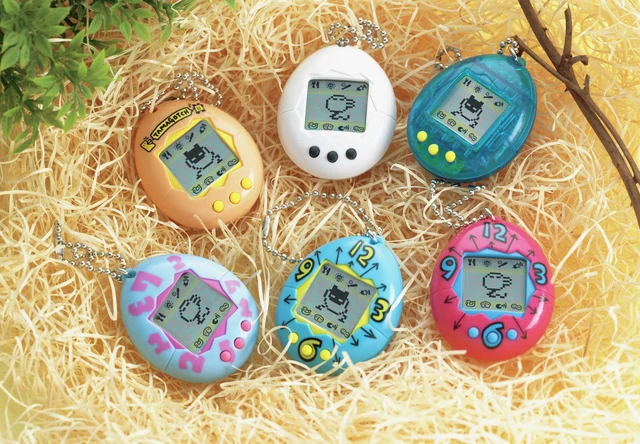
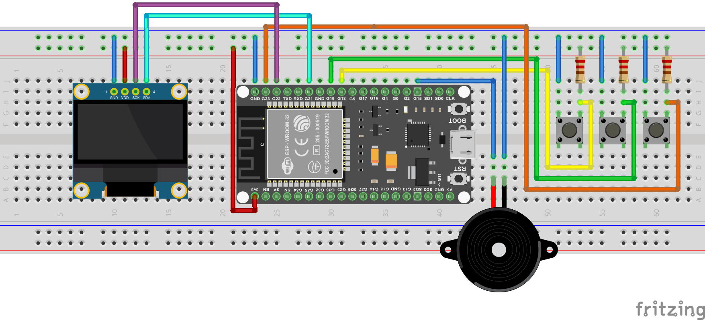
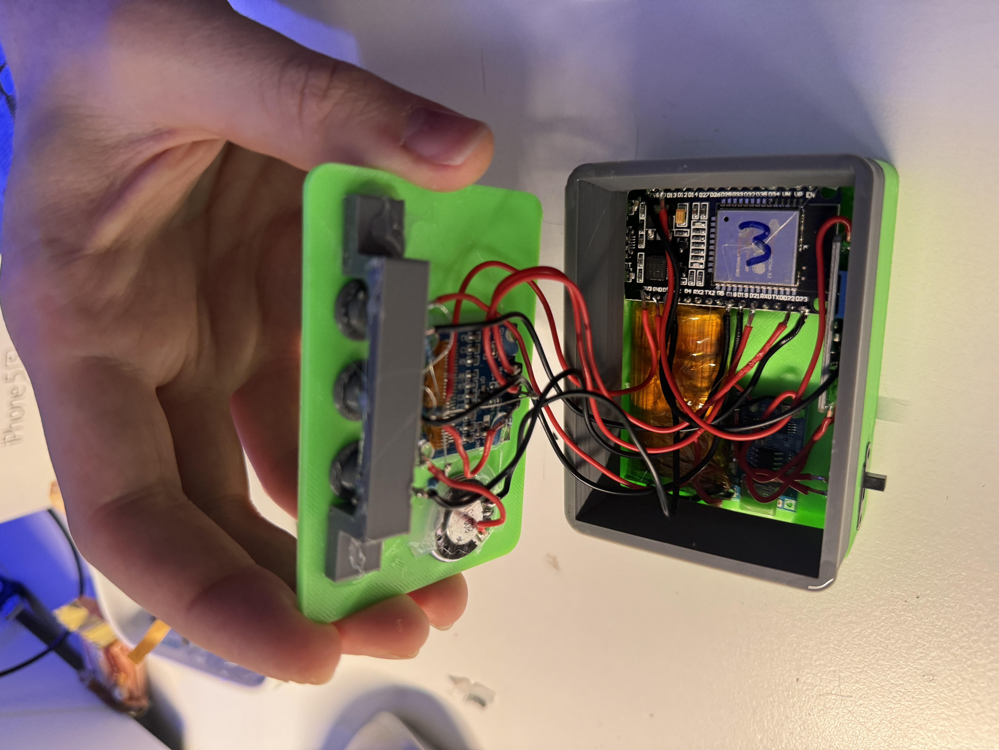

# ArduinoGotchi - A real Tamagotchi emulator for ESP32

## Synopsis

**ArduinoGotchi** is a real [Tamagotchi P1](https://tamagotchi.fandom.com/wiki/Tamagotchi_(1996_Pet)) emulator running in Arduino UNO hardware. The emulation core is based on [TamaLib](https://github.com/jcrona/tamalib) with intensive optimization to make it fit into UNO's hardware that only comes with 32K Flash 2K RAM.

## Improvements

The repo adds a few improvements over the original repo [anabolyc/Tamagotchi](https://github.com/anabolyc/Tamagotchi):

* added `ESP32` platform
* added experimental deepsleep feature for `ESP32` and `ESP8266`
* flexible button configuration

## Build

### Firmware

First, install Visual Code and the PlatformIO plugin.
Open the `firmware/Tamagotchi32` folder as `Workspace-Folder`

Open the Platformio by clicking on the Icon on the left sidebar.
Select your desired plattform:

* nanoatmega328
* esp8266
* esp32

and use the `build` task to build for the selected platform. Next run `Upload` or `Upload and Monitor` to upload the firmware to the connected board.

### Circuit Diagram

| FROM ESP32    | TO COMPONENT                     |
|---------------|----------------------------------|
| 3v3           | VDD (DISPLAY, PULL-UP RESISTORS) |
| GND           | GND (DISPLAY, BUZZER, BUTTONS)   |
| G22           | SCL (DISPLAY)                    |
| G21           | SDA (DISPLAY)                    |
| G15           | BUZZER                           |
| G23, G18, G19 | BUTTONS                          |

#### NOTE

The firmware supports the `ESP8266` platform too, please connect the `RST` and `D0` pin to enable the deepsleep feature.

### Case

The case can be found here [CASE](https://www.thingiverse.com/thing:2374552)
A additional case spacer can be found in the `hardware/stl` folder
### Example build

For the example build the following parts were used:

* ESP32 Devboard
* 0.96" OLED Display `SSD1306 I2C 128x64`
* 3x Buttons (e.g. `Keyestudio Digital Push Button`, resistors already included)
* [OPTIONAL] 3x 10k pull-up resistors
* 1s USB-C lipo charging board (e.g. `DFRobot DFR0668`)
* 1s 3.7v 220mAh LIPO with protection board (e.g. `XZD-2004`)
* StepUp converter (e.g. `MT3608`, better `TPS63020`)
* Buzzer (e.g. `KY-006`)

## Game notes

- To activate your pet, you have to configure the clock by pressing the middle button. Otherwise, your pet will not alive.
- A long click on "middle" button for 5 seconds, will reset memory back to egg state
- A long click on "left" button for 5 seconds, will enter the deepsleep mode for 10 minutes

### License
The base project ArduinoGotchi is distributed under the GPLv2 license. See the LICENSE file for more information.
